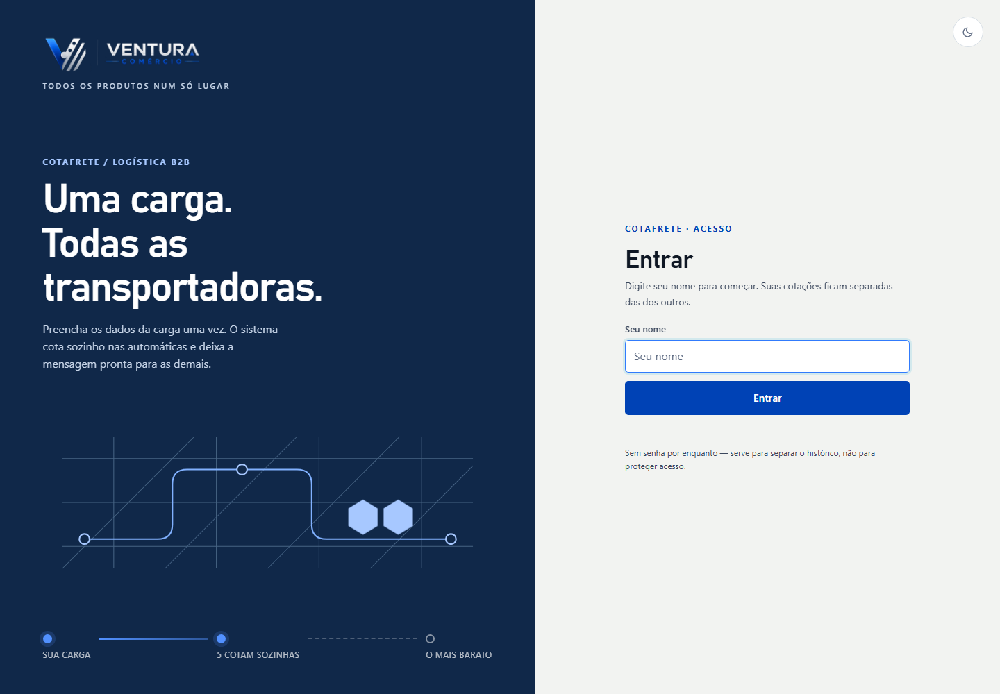
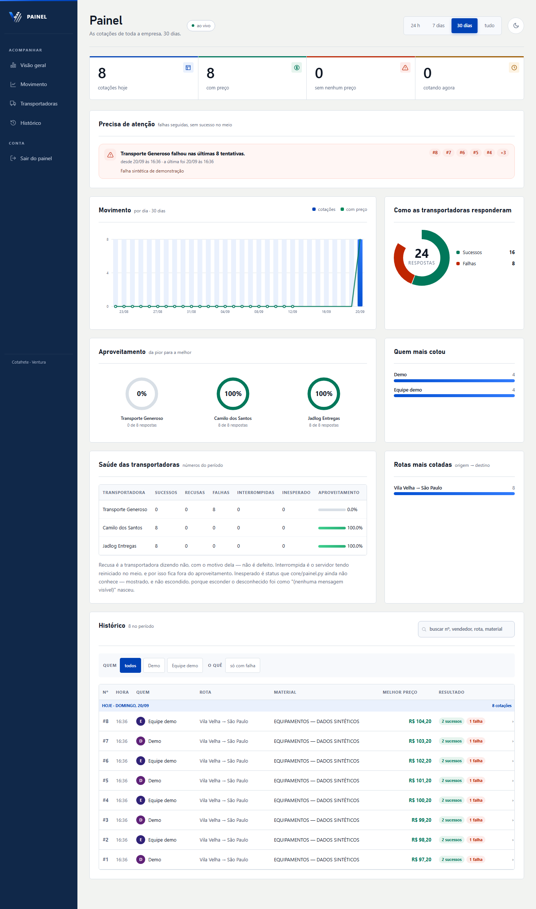

# Cotafrete — rebranding Codex / skills atuais

Branch: `rebranding/skills-atuais`. Duas implementações independentes do mesmo pedido: rebranding corporativo de todas as telas, heroes SVG animados, formulário, resultados, histórico, ajuda e painel administrativo. Identidade Ventura e funcionalidades preservadas. Sem dependências novas de animação.

## Resultado visual e validação

- **321 testes funcionais passaram em cada branch**, na mesma suíte de layout, painel, cotação, ficha, documentação e autenticação administrativa.
- **44 verificações visuais passaram por branch**: 11 telas × 390/1440px × claro/escuro. HTTP 200, nenhum erro JavaScript, nenhum overflow horizontal do documento e nenhuma animação longa em execução com movimento reduzido.
- Capturas usam somente dados fictícios. A rede externa foi bloqueada durante as capturas; nenhuma cotação real, mensagem ou e-mail foi enviado.
- [Direção visual, referências e mapa de telas](IMPLEMENTACAO.md) · [Medições visuais](qa-comum/results.json) · [Saída dos testes](qa-comum/pytest.txt).





[Login no celular](qa-comum/login-390-claro.png) · [Formulário](qa-comum/formulario-1440-claro.png) · [Dashboard no celular](qa-comum/dashboard-390-claro.png) · [Tema escuro](qa-comum/dashboard-1440-escuro.png).

## Consumo medido das duas sessões Codex

| Métrica em tokens | Skills atuais | Contexto enxuto |
|---|---:|---:|
| Entrada total (inclui cache) | 3.701.482 | 3.048.708 |
| Entrada reutilizada em cache | 3.249.152 | 2.612.352 |
| Entrada sem cache | 452.330 | 436.356 |
| Saída total | 20.777 | 16.947 |
| Raciocínio (já incluído na saída) | 2.423 | 2.331 |
| Total processado: entrada + saída | 3.722.259 | 3.065.655 |

Nesta execução, o perfil enxuto processou **656.604 tokens a menos (17.64%)**. Considerando apenas entrada sem cache + saída, os valores foram **473.107 e 453.303**, diferença de **4.19%**. Essa segunda soma também não é uma tarifa: entrada e saída podem ter pesos diferentes.

Os milhões representam a soma de entradas repetidas a cada chamada, incluindo histórico e ferramentas; não representam milhões de palavras diferentes produzidas. Cache já faz parte da entrada e raciocínio já faz parte da saída: somá-los novamente daria dupla contagem. `cache_write_input_tokens` foi zero nas duas sessões.

### Fonte e contagem

Os números vêm do último evento `token_count.info.total_token_usage` de cada sessão do Codex, conferido com `threads.tokens_used` no estado local. Esse total é cumulativo: inclui os turnos anteriores às interrupções, retomadas e correções finais. Não somamos novamente os totais cumulativos de cada retomada.

- Skills atuais: `01a0a0e0-876d-7440-83ee-459d490274d0`; última medição `2026-09-20T00:59:30.695Z`.
- Enxuto: `01a0a0e5-4f9f-7082-8887-59bb62c24151`; última medição `2026-09-20T00:59:30.316Z`.
- [Dados completos, hashes e evidências](dados-tokens.json). Os logs integrais ficam localmente em `C:/Users/vendas12/enzo/cotafrete-benchmark/` e no histórico do Codex; não foram publicados porque podem incluir contexto privado da máquina.

### Condições do teste

Mesmo commit-base `806f1ff6ca882235d9f12ed6fa543c6862a1ce43`, prompt inicial idêntico, modelo `gpt-6-astra`, esforço `low`, sessões novas e worktrees separados. Cada sessão fez sua própria pesquisa e implementação, sem ler o resultado da outra e sem subagentes. [Prompt original](PROMPT.txt).

O perfil atual manteve os plugins habilitados. O perfil enxuto desativou ECC e Superpowers e acrescentou um `AGENTS.md` curto. Neste ambiente, somente os overrides de plugin não removeram ECC do catálogo: foi necessário também desativar as skills por caminho no perfil separado `cotafrete-benchmark-enxuto.config.toml`. A configuração global principal não foi substituída.

O catálogo inicial registrado mostrou **311 e 57 entradas visíveis**, respectivamente; ECC teve **283 e zero**. Superpowers não apareceu no catálogo inicial de nenhuma das duas, apesar de habilitado na configuração original: não é possível atribuir a ele uma economia isolada. As descrições das skills remanescentes também podem ocupar mais espaço quando há menos entradas.

A primeira chamada usou **25.689 e 23.552 tokens de entrada**, redução de **8,32%**. Isso mede toda a entrada inicial, não apenas as skills. A redução total posterior inclui diferenças na quantidade de leituras, tentativas, correções e respostas.

### Gastos adicionais e limitações

- Uma primeira tentativa enxuta carregou ECC indevidamente e foi interrompida: **105.859 tokens** (105.443 de entrada, incluindo 71.424 em cache, e 416 de saída). Está registrada separadamente como `tentativa-invalida`; não entra na comparação válida, mas foi consumo real do experimento.
- A conversa coordenadora também consumiu tokens preparando, monitorando, diagnosticando, revisando e documentando o experimento. No recorte desde o pedido original até **2026-09-20T19:38:00.462Z**, foram **14.560.548 tokens processados**, dos quais **13.870.848 de entrada em cache**. Esse é um retrato parcial anterior à publicação e resposta final, compartilhado entre as duas branches, sem divisão arbitrária. Não está incluído nos totais das sessões da tabela.
- A conta atingiu limites durante o trabalho em 14/09; houve retomadas em datas posteriores, erros de permissão do sandbox e correções após QA externo. Tempo de calendário não equivale a tempo de implementação. A memória compartilhada também ficou indisponível durante parte do experimento.
- As sessões tiveram as mesmas regras de sandbox. A validação comum do coordenador foi feita fora do bloqueio do navegador, nas duas versões. Scripts/testes externos não fazem chamadas ao modelo; sua preparação e revisão pertencem ao custo compartilhado do coordenador.
- Na revisão visual final, o coordenador acrescentou `width:auto` em `.abertas .hora` na versão skills atuais: a sessão havia corrigido a quebra de texto, mas deixado a largura de célula herdada, tornando o horário vertical. Essa intervenção de uma linha pertence ao consumo compartilhado, não à sessão da tabela. Os artefatos incluem essa correção assistida.
- É **uma execução por configuração**, com mudanças simultâneas de catálogo e instruções locais, efeitos de cache e escolhas de implementação. O resultado não demonstra que desativar skills sempre economiza esta porcentagem nem isola causalmente cada plugin.
- Login do vendedor continua com o comportamento do commit-base. As branches não incorporam os commits posteriores da `main`, inclusive mudanças posteriores de autenticação. Antes de usar em produção, integrar a versão escolhida à base atual e repetir a validação.
- Os contadores são de tokens do Codex, **não uma fatura em reais/dólares** nem uma conversão exata do limite do plano Plus. O consumo do observador Claude Mem e de outras sessões/aplicativos não está nesses contadores.
- As duas branches do Claude são experimentos separados (`rebranding/claude-skills-atuais` e `rebranding/claude-contexto-enxuto`). Seus arquivos, commits e relatórios não foram alterados por esta entrega; estes números não são uma comparação Codex × Claude.

## Como visualizar nesta máquina

Na pasta desta branch, execute:

```powershell
& C:/Users/vendas12/enzo/cotafrete-dev/.venv/Scripts/python.exe validar.py --serve
```

Abra `http://127.0.0.1:8765`. A prévia usa dados sintéticos e não envia operações às transportadoras. O roteiro de cada branch tem sua própria implementação; a suíte externa comum é a evidência equivalente usada na comparação. As animações são originais e finitas; as capturas estáticas não demonstram o movimento.

## Organização das branches

Esta é uma alternativa completa, não um complemento da outra. As quatro branches têm nomes e worktrees diferentes e podem coexistir. Como redesenham os mesmos arquivos, mesclá-las entre si pode gerar conflitos. Não foi feito merge na `main` nem deploy.
